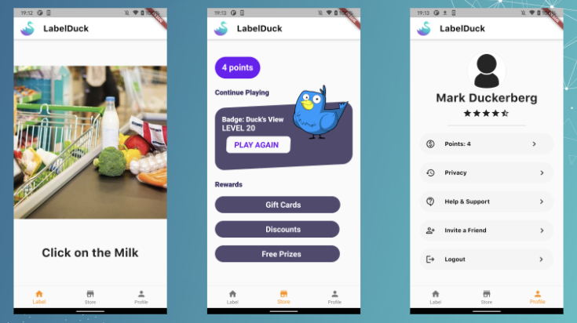

# LabelDuck - Google BGN Hackathon 2021

1 of 65 participants selected from all over world to participate in the Google's first virtual BGN Hackathon that involved total 10 strong teams.

In a team of 7, developed an application to help aid small businesses with easing the process of labelling datasets. "LabelDuck" allows these startups to provide us with data they need labelled. We then process this through a pre-trained model, which then sends obscure data with accuracy lower than 95% to users through crowdsourcing. These users are then able to label and collect incentives along the way.

</img>
